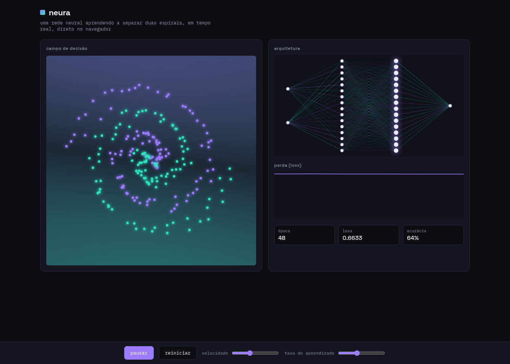

# neura

Uma rede neural aprendendo, em tempo real, a separar duas espirais entrelaçadas, direto no navegador, sem nenhuma biblioteca de machine learning.



## O que é

`neura` é um MLP (multilayer perceptron) com forward pass, backpropagation e otimização por momentum implementados à mão em JavaScript puro. Enquanto a rede treina, três painéis mostram o que está acontecendo por dentro:

- **Campo de decisão**: a fronteira que a rede está desenhando entre as duas classes, atualizada a cada frame.
- **Arquitetura**: o diagrama da rede (2-16-16-1), com a espessura e a cor de cada aresta representando o peso correspondente, e um pulso contínuo percorrendo as camadas.
- **Perda (loss)**: a curva de erro caindo conforme o treino avança.

O problema escolhido, duas espirais entrelaçadas, é um clássico de teste para redes pequenas justamente porque não é linearmente separável: a rede precisa aprender uma fronteira curva e complexa para resolvê-lo.

## Como rodar localmente

Não há build nem dependências. Qualquer servidor estático funciona:

```bash
npm run dev
# ou
python3 -m http.server 8080
```

Depois abra `http://localhost:8080` no navegador.

## Controles

- **pausar / continuar**: pausa e retoma o treinamento (a animação de pulso na rede continua mesmo pausado).
- **reiniciar**: gera um novo dataset e reinicia os pesos da rede do zero.
- **velocidade**: quantos passos de treino rodam por frame.
- **taxa de aprendizado**: o `lr` usado no gradiente descendente com momentum.

## Como funciona por dentro

- **Dataset**: duas espirais geradas parametricamente (`generateSpiral`), com ruído aleatório, normalizadas para o intervalo `[-1, 1]`.
- **Rede**: MLP totalmente conectado `[2, 16, 16, 1]`, ativação `tanh` nas camadas ocultas e `sigmoid` na saída, treinado com entropia cruzada binária.
- **Otimização**: gradiente descendente com momentum (`0.9`), que acelera a convergência e cria uma evolução mais dinâmica da fronteira de decisão.
- **Renderização**: o campo de decisão é calculado em um buffer de baixa resolução e escalado com suavização (`imageSmoothingEnabled`) para um visual contínuo; o diagrama da rede usa `shadowBlur` para o brilho dos nós e das arestas.

Todo o código está em `app.js`, sem frameworks, sem bundler, sem dependências de runtime.

## Licença

[MIT](LICENSE)
